---
# ORACLE Cloud-Native DevOps workshop #
----
## Eclipse IDE (Oracle Enterprise Pack for Eclipse) と Developer Cloud Service を用いた開発ライフサイクル管理

### 説明

このチュートリアルは Developer Cloud Service を用いた標準開発ワークフローに基づいている。Developer Cloud Service を使用するとチームがどのように変更管理に協力して取り組むかを説明する事を目的としている。

オンプレミス・サイロ型アプリケーション・アーキテクチャに対して、クラウド・ネイティブ・アプリケーションの最大の差異は、サービス間に依存関係を構成についてである。例えば、Application Container Cloud Service にデプロイしたアプリケーションが、Java Cloud Service で稼働するサービスなどにアクセスする必要があるとする。明示的なエンドポイントや、構成情報でさえもソースコードにハードコードする事は、誤ったアプローチとされており、特にクラウドの世界において誤りであると言われている。例えば、IP アドレスやURLといったサービス・エンドポイントはすぐに変更されうるためである。アプリケーション・アーキテクチャを柔軟に保つために、Application Container Cloud Service は、**サービス・バインディング** を提供している。これにより、他の契約している Oracle Cloud Services (例えば、Java Cloud Service や Databasrd Cloud Service) に対するバインディング情報を追加する事ができる。追加する際には、Application Container Cloud Servcie のコンソール画面か、メタ情報ファイルである`deployment.json`を使用する。


このチュートリアルでは、Spring Boot サンプル・アプリケーションに対する変更として、REST 応答を表示する新しいページの作成を行う。REST エンドポイントはJava Cloud Service 上にホストする。

### チュートリアルについて
このチュートリアルは、以下を実施する:

- Developer Cloud Service を用いて問題管理/タスク管理を作成する
- OEPE Cloud Tooling を用いて問題/タスクを起票及びクローズを行う
- コードの変更を行い、Developer Cloud Service にホストしているGit リポジトリに格納する
- コードの変更を起点に継続的インテグレーションを起動する
- Application Container Cloud Service に対してサービス・バインディングを作成する
- OEPE Cloud Tooling を用いてApplication Container Cloud Service への再デプロイを確認する

### 前提

- 以下のチュートリアルを実施済みである事
  - [Spring Boot アプリケーション用のDeveloper Cloude Service プロジェクトの作成](../springboot-sample/create.devcs.project.md)
  - [Developer Cloud Service と Application Container Cloud Service を用いた継続的ビルド・インテグレーションの作成](../springboot-sample/devcs.accs.ci.md)
  - [Developer Cloud Service を用いた Eclipse 統合開発環境 (Oracle Enterprise Pack for Eclipse) の利用](../oepe/setup.oepe.md)
  -[TechCo (Java EE) サンプル・アプリケーションの Java Cloud Service へのデプロイ](../jcs-deploy/README.md)

### 手順

#### Developer Cloud Service の UI を用いて問題管理を作成する

Oracle Cloud へ[サインイン](../common/sign.in.to.oracle.cloud.md) する [(https://cloud.oracle.com/sign-in)](https://cloud.oracle.com/sign-in)。
データセンターを選択し、アイデンティティドメインとアカウント情報を入力してログインする。
ログイン後、ダッシュボード画面の Developer Cloud Service のドロップダウンメニューから **サービス・コンソールを開く** を選択する。


Spring Boot サンプル・アプリケーションプロジェクトを開き、**Issues** タブをクリックする。**New Issue** をクリックする。

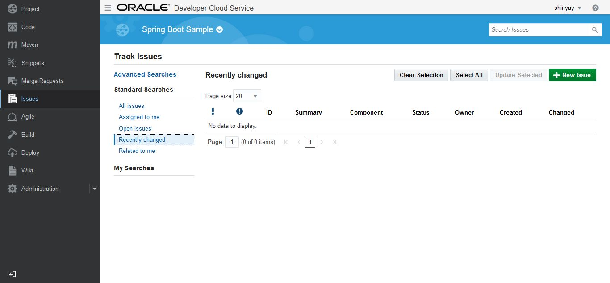


新しいタスクのプロパティを入力する。新しいタスクは、「チュートリアル: [TechCo (Java EE) サンプル・アプリケーションの Java Cloud Service へのデプロイ](../jcs-deploy/README.md)」でデプロイしたアプリケーションの REST インターフェースを使用して Spring Demo アプリケーションに TechCo 整品を表示する新しいページを作ることである。特定のユーザに対してタスクを割り当てた想定で自分自身のアカウントに対して新しく割り当てるタスクを作成を行うようにする。
次のパラメータを入力する:

- New Issue
  - Summary: **RESTを使用してTechCo整品を表示する新しいページ**
  - Description: **<br>-TechCo整品を表示する新しいページの作成<br>-TechCoアプリケーションのRESTインターフェースの使用**
- Details
  - Type: **Task**
  - Severity: **Normal**
  - Priority: **Normal**
  - Product: **Default**
  - Component: **Default**
  - Found In: 空欄
  - Status: **New**
  - Release: **0.0.1**
  - Owner: **<自分自身のユーザ名>**
  - CC: 空欄
  - Tags: 空欄
- Time
  - Due Data: **翌日の日付**
  - Estimated Days: **1**
  - Story Points: 空欄

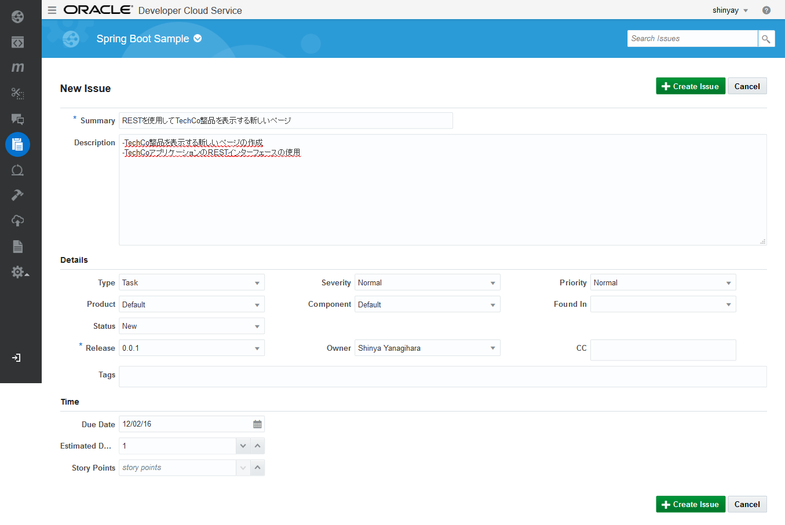


次に OEPE を変更して割り当てたタスクを確認する。OEPE が既に開かれて Oracle Cloud との接続がアクティベートされていれば、Eclipse にタスクの割当てに関する通知が確認できる。OEPE タスクを開くためには、**通知のリンクをクリックする** または、**Oracle Cloud ビューから Issues を開く** 操作を行う。Oracle Cloud ビューから開く場合は、次の階層を開く。
**[ 接続名 ]** -> **Developer** -> **[ DevCSプロジェクト名 ]** -> **Issues** -> **Mine**


タスクをダブルクリックして詳細を開く。

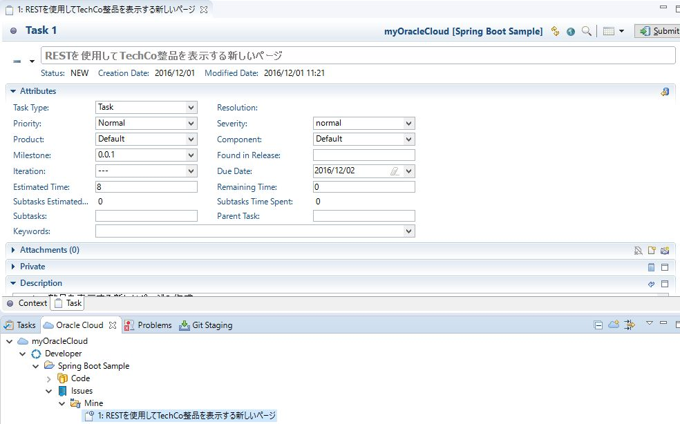


スクロール・ダウンし、Actions 項目で **Accept** を選択し、**Submit** をクリックして開発作業を開始する。

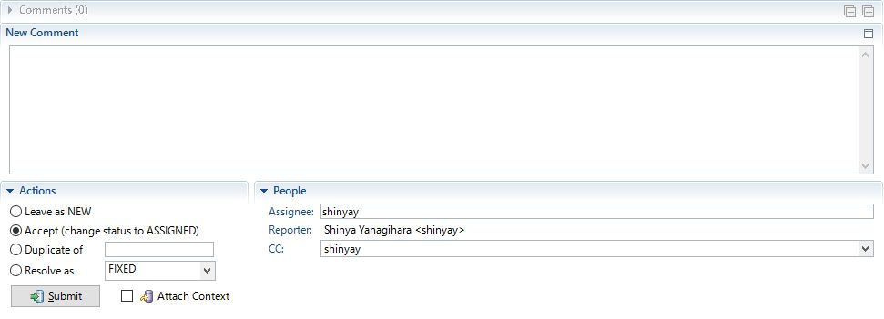


#### アプリケーションへの新フィーチャーの実装

まず、Maven プロジェクトに対して必要な以下の依存ライブラリを追加する。
 - `org.apache.httpcomponents`: REST コールを行う
 - `org.glassfish.javax.json`: JSON フォーマットのレスポンスを処理する

**pom.xml** を開き、**Dependencies** タブを選択する。次に、依存ライブラリの追加をするために、**Add...** をクリックする。


`org.apache.httpcomponents` の各属性値は次の内容を入力する:

- **Group Id**: org.apache.httpcomponents
- **Artifact Id**: httpclient
- **Version**: 4.5

**OK** をクリックする。

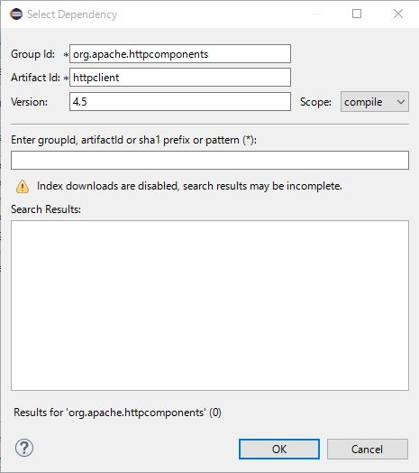


`org.glassfish.javax.json` の各属性値は次の内容を入力する:

- **Group Id**: org.glassfish
- **Artifact Id**: javax.json
- **Version**: 1.0.4

**OK** をクリックする。

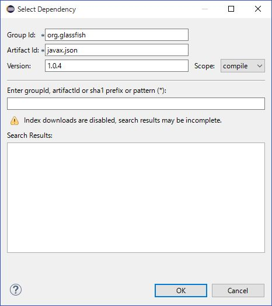


依存ライブラリを追加した結果、`pom.xml` は次のようになる。


次にコードの編集を行う。***springbootdemo*** プロジェクトの **Java Resources -> src/main/java -> com.example.springboot.config -> WebConfig.java** を開き、 `public void addViewControllers(ViewControllerRegistry registry)` メソッドに、以下の新しいページのView Contoroler の登録を記述する。

```java
registry.addViewController("/restcall").setViewName("restcall");
```

WebConfig クラスは次のようになる:

```java
package com.example.springboot.config;

import org.springframework.context.annotation.Bean;
import org.springframework.context.annotation.ComponentScan;
import org.springframework.context.annotation.Configuration;
import org.springframework.web.servlet.DispatcherServlet;
import org.springframework.web.servlet.config.annotation.DefaultServletHandlerConfigurer;
import org.springframework.web.servlet.config.annotation.EnableWebMvc;
import org.springframework.web.servlet.config.annotation.ViewControllerRegistry;
import org.springframework.web.servlet.config.annotation.WebMvcConfigurerAdapter;
import org.springframework.web.servlet.view.InternalResourceViewResolver;
import org.springframework.web.servlet.config.annotation.ResourceHandlerRegistry;

@EnableWebMvc
@ComponentScan
@Configuration
public class WebConfig extends WebMvcConfigurerAdapter {

	private static final String[] CLASSPATH_RESOURCE_LOCATIONS = {
        "classpath:/META-INF/resources/", "classpath:/resources/",
        "classpath:/static/", "classpath:/public/" };

	@Override
	public void addResourceHandlers(ResourceHandlerRegistry registry) {
	    registry.addResourceHandler("/**").addResourceLocations(CLASSPATH_RESOURCE_LOCATIONS);
	}

	@Override
	public void addViewControllers(ViewControllerRegistry registry) {
		registry.addViewController("/").setViewName("welcome");
		registry.addViewController("/env").setViewName("environment");
		registry.addViewController("/heap").setViewName("heap");
		registry.addViewController("/cpu").setViewName("cpu");
		registry.addViewController("/restcall").setViewName("restcall");
	}

	@Bean
	public InternalResourceViewResolver viewResolver() {
		InternalResourceViewResolver viewResolver = new InternalResourceViewResolver();
		viewResolver.setPrefix("/WEB-INF/views/");
		viewResolver.setSuffix(".jsp");
		return viewResolver;
	}

	@Bean
	// Only used when running in embedded servlet
	public DispatcherServlet dispatcherServlet() {
		return new DispatcherServlet();
	}

	@Override
	public void configureDefaultServletHandling(
			DefaultServletHandlerConfigurer configurer) {
		configurer.enable();
	}
}
```

OEPE上では次のようになる:


この追加した部分は、新しい JSP ページへ `/restcall` でのパスを定義している。次に新しいページを作成する。**Deployed Resources -> webapp -> WEB-INF -> views** の配下に新しいページを作成する。**views** を右クリックして **New -> JSP File** を選択する。

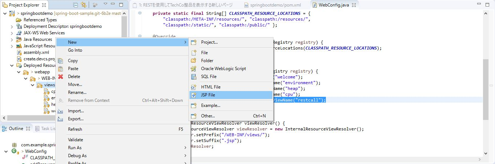


**JSP File** 項目がメニューに表示されない場合は、**Other...** を選択して **JSP File** をウィザード・ダイアログから見つけ、**Next** をクリックする。

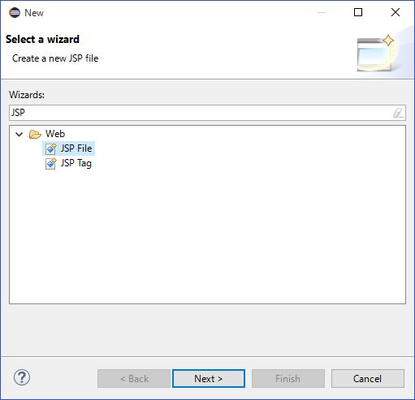


File name に、`restcall.jsp` を入力し、**Finish** をクリックする。

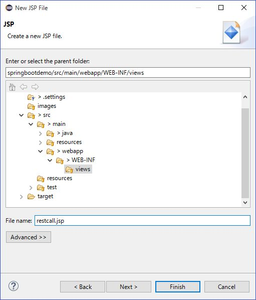


新しいページはデザイン・ビューで開かれる。ソースコード・ウインドウで、次の内容を選択して全て置き換える:

```jsp
<%@ page language="java" contentType="text/html; charset=UTF-8"
  pageEncoding="UTF-8"%>
<!DOCTYPE html PUBLIC "-//W3C//DTD HTML 4.01 Transitional//EN" "http://www.w3.org/TR/html4/loose.dtd">
<%@ taglib prefix="spring" uri="http://www.springframework.org/tags"%>
<%@ taglib prefix="c" uri="http://java.sun.com/jsp/jstl/core"%>

<%@ page import="java.io.InputStreamReader" %>
<%@ page import="java.security.cert.CertificateException" %>
<%@ page import="java.security.cert.X509Certificate" %>

<%@ page import="javax.json.Json" %>
<%@ page import="javax.json.JsonArray" %>
<%@ page import="javax.json.JsonObject" %>
<%@ page import="javax.json.JsonReader" %>
<%@ page import="javax.net.ssl.SSLContext" %>

<%@ page import="org.apache.http.client.methods.CloseableHttpResponse" %>
<%@ page import="org.apache.http.client.methods.HttpGet" %>
<%@ page import="org.apache.http.conn.ssl.NoopHostnameVerifier" %>
<%@ page import="org.apache.http.conn.ssl.SSLConnectionSocketFactory" %>
<%@ page import="org.apache.http.impl.client.CloseableHttpClient" %>
<%@ page import="org.apache.http.impl.client.HttpClientBuilder" %>
<%@ page import="org.apache.http.impl.client.HttpClients" %>
<%@ page import="org.apache.http.ssl.SSLContexts" %>
<%@ page import="org.apache.http.ssl.TrustStrategy" %>

<html lang="en-US" >
<head><meta http-equiv="Content-Type" content="text/html; charset=UTF-8">
<meta http-equiv="X-UA-Compatible" content="IE=edge">
<meta name="viewport" content="width=device-width, initial-scale=1.0, maximum-scale=1">
<meta http-equiv="Content-Type" content="UTF-8">

<style>
table {
  font-family: arial, sans-serif;
  border-collapse: collapse;
  width: 100%;
}

td, th {
  border: 1px solid #dddddd;
  text-align: left;
  padding: 8px;
}

tr:nth-child(even) {
  background-color: #dddddd;
}
</style>

<title>About Oracle Application Container Cloud</title>

</head>
<body style="padding: 10px; border: 10px;">
Spring Boot application demo.
<br>
<h2>REST call to Oracle Java Cloud Service from Oracle Application Container Cloud</h2>
<hr>
<div>
<%
final String JCS_URL = "JAAS_SECURE_CONTENT_URL";
final String JCS_PORT = "JCS_PORT";
final String TECHCO_REST_PATH = "TECHCO_REST_PATH";
String sURL = System.getenv().get(JCS_URL);
String restPath;
String port;

if (System.getenv().get(TECHCO_REST_PATH) != null) {
  restPath = System.getenv().get(TECHCO_REST_PATH);
} else {
  restPath = "/TechCo-ECommerce/rest/products/all";
}

if (System.getenv().get(JCS_PORT) != null) {
  port = ":" + System.getenv().get(JCS_PORT);
} else {
  port = "";
}


  if (sURL == null) {
    out.write("<p><b>Java Cloud Service Instance bindings</b> (" + JCS_URL + "): <mark>Not defined.</mark></p>");
    out.write("<p>Please create service binding for application deployed on Oracle Application Container Cloud.</p>");
  } else {

    out.write("<p><b>Java Cloud Service Instance bindings (" + JCS_URL + "):</b> <mark>" + sURL + "</mark></p>");

    try {
      SSLContext sslContext = SSLContexts.custom().loadTrustMaterial(null, new TrustStrategy() {

              @Override
              public boolean isTrusted(final X509Certificate[] chain, final String authType) throws CertificateException {
                  return true;
              }
          }).build();

      SSLConnectionSocketFactory sslsf = new SSLConnectionSocketFactory(sslContext, NoopHostnameVerifier.INSTANCE);

      HttpClientBuilder builder = HttpClients.custom().setSSLSocketFactory(sslsf);
      CloseableHttpClient httpclient = builder.build();
    HttpGet httpGet = new HttpGet(sURL + port + restPath);

    out.write("<p><b>Execute REST call:</b> <mark>" + sURL + port + restPath + "</mark></p>");
    CloseableHttpResponse restResponse = httpclient.execute(httpGet);

    out.write("<p><b>HTTP Response:</b> " + restResponse.getStatusLine() + "</p>");

    if (restResponse.getStatusLine().getStatusCode() == 200) {
      if (restResponse.getEntity() != null) {

        out.write("<p><b>HTTP Content (formatted):</b></p>");
        out.write("<p>");
        out.write("<table>");
        out.write("  <tr>");
        out.write("    <th>Product Name</th>");
        out.write("    <th>Product Description</th>");
        out.write("  </tr>");

        InputStreamReader is = new InputStreamReader((restResponse.getEntity().getContent()));
        JsonReader rdr = Json.createReader(is);
        JsonObject obj = rdr.readObject();
        JsonArray results = obj.getJsonArray("products");
        for (JsonObject result : results.getValuesAs(JsonObject.class)) {

          out.write("  <tr>");
          out.write("    <td>");      
          out.write(result.getInt("productId") + " " + result.getString("productName"));
          out.write("    </td>");
          out.write("    <td>");
          out.write(result.getString("productDescription"));
          out.write("    </td>");
          out.write("  </tr>");
        }
        out.write("<table>");
        out.write("</p>");
      }
    } else {
      out.write("<br><b>Reason:</b> " + restResponse.getStatusLine().getReasonPhrase());
    }
  } catch (Exception e) {
    out.write("<p style=color:red;><b>Exception:</b></p><br>" + e.getMessage());
    e.printStackTrace();
  }
  }

%>
</div>
</body>
</html>
```

OEPE では次のようになる :


ここでアプリケーションのビルドを行う。`pom.xml` を右クリックし、**Run As -> Maven install** を選択する。


コンソール・ビューでビルド結果が確認できる。


#### Developer Cloud Service プロジェクトでホストしているリモート・リポジトリに変更内容をプッシュ

実装及びスモーク・テストが終了した後、リモート・リポジトリに変更内容をプッシュする必要がある。そこで、プロジェクトを右クリックし、**Team -> Commit...** を選択する。

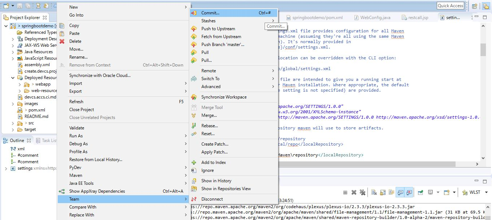


Git Staging ビューが表示される。`restcall.jsp`、`pom.xml` 及び  `WebConfig.java` を ***Staged Changes*** へドラッグ・アンド・ドロップする。Eclipse 固有のファイルはローカル Git リポジトリに追加する必要はない。そして、コミット・メッセージを入力する。今回のケースでは、**Task 1** と入力すると、リンクに変わる。OEPE Cloud Tooling で問題管理システムに存在するタスクを判別し、コミット・メッセージにタスクへのリンクを作成する事ができる。名前とクラウドのユーザ名(メール・アドレス)を入力する。**Commit and Push...** をクリックする。

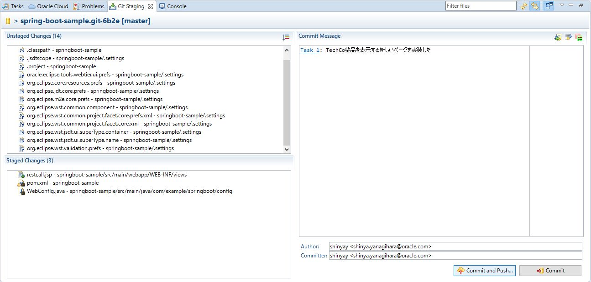


プッシュ・ダイアログが表示されたら、デフォルトのマスター・ブランチのままにして、**OK** をクリックする。


Developer Cloud Service プロジェクトのビルド・ページをブラウザで開く。Git リポジトリにより起動された新しいビルドが確認できる。

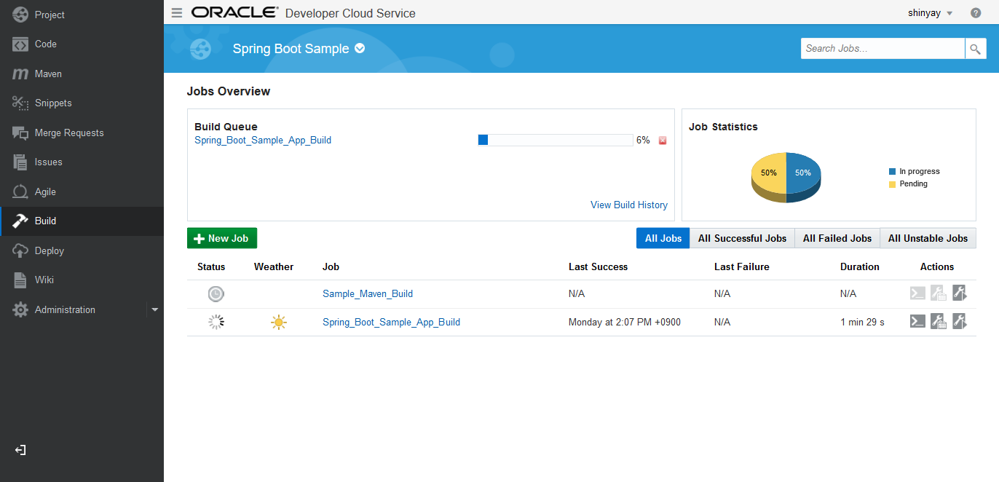


ビルド完了後にデプロイ・タブに移動すると、新しいデプロイ処理を確認する事ができる。


Application Container Clou Service へデプロイが正常終了すると、デプロイ結果が右側の履歴に新しく追加される。***Deploy to ACCS*** 野となりのリンクをクリックすると、アプリケーションにアクセスできる。

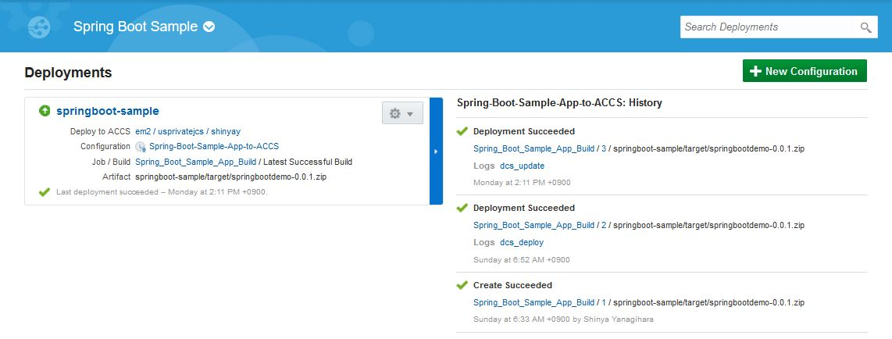


アプリケーションのウェルカム・ページは変更されていない。

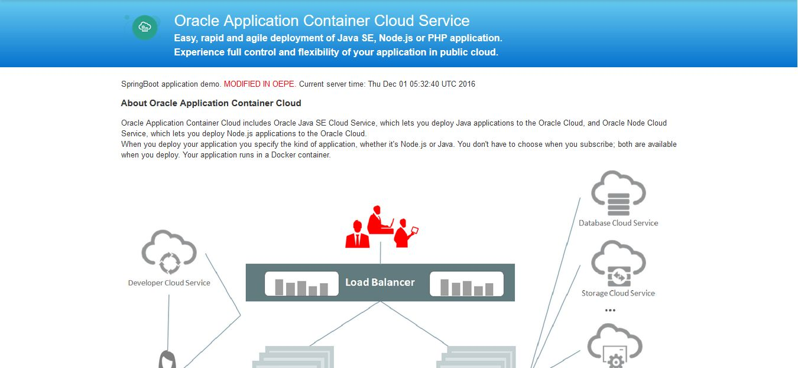


次に新しいページにアクセスする。URL に `/restcall` を追加する。


新しいページが表示される事を確認できた。しかし、Java Cloud Service 上ので稼働している　TechCo アプリケーションにバインドし到達している結果は確認できない。

#### Application Container Cloud Service 上のアプリケーションへの Java Cloud Service バインディングの作成

まず、TechCo アプリケーションの REST インターフェースをテストする。ブラウザで新しいタブを開き、Java Cloud Service コンソールを表示する。ダッシュボードが表示されなｋったり、他のサービス・コンソールが表示される場合、Oracle Cloud へ[サインイン](../common/sign.in.to.oracle.cloud.md) し [(https://cloud.oracle.com/sign-in)](https://cloud.oracle.com/sign-in)、ダッシュボード画面の Java Cloud Service のドロップダウンメニューから **サービス・コンソールを開く** を選択する。


アプリケーションをデプロイしたサービス・インスタンス名をクリックする。


サービス・インスタンスの詳細ページで、管理対象サーバが含まれている仮想マシンのパブリックIPアドレスを控える。


ブラウザで次のURLを開く: `http://<public-ip-address>/TechCo-ECommerce/rest/products/all`

全ての整品の問い合わせをする REST インターフェースの JSON形式のレスポンスを確認できる。Spring Boot サンプル・アプリケーションがこれを起動し、新しく作成したページに結果を表示する。

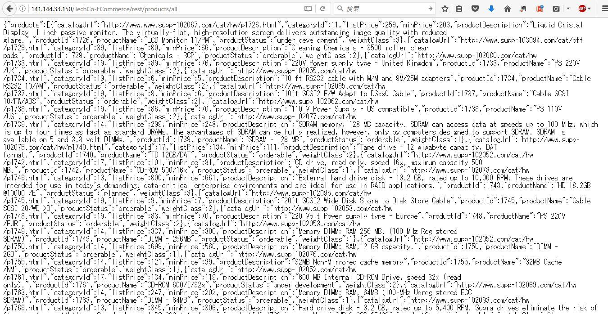


Application Container Cloud Service コンソールに戻り、インスタンスを管理しているサービス名をクリックする。


デプロイメント・タイルをクリックし、***Service Bindings*** の **Add** をクリックする。

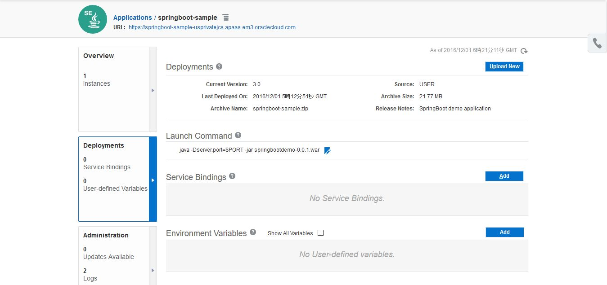


次の属性値を用いて、サービス・バインディングを構成する:

- **Service Type**: Java Cloud Service
- **Service Name**: techco (the name of JCS instance where the TechCo アプリケーションがデプロイされている JCS インスタンス名)
- **Username** and **Password**: Java Cloud Service 管理ユーザ


**Apply Edits** をクリックすると、サービスが再起動する。

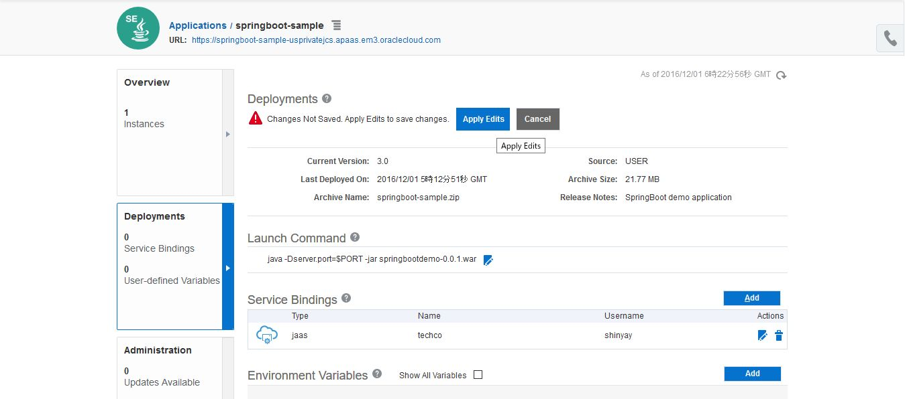

**Rolling Restart** を選択し、**Restat** をクリックする。


再起動が終わったら、Spring Boot サンプル・アプリケーションの新しいページへ切り替える:
`https://springboot-demo-<identitydomain>.apaas.<datacenter>.oraclecloud.com/restcall`


サービス・バインディングの作成が成功すると、Spring Boot サンプル・アプリケーションは TechCo アプリケーションの REST インターフェースを呼び出すことができ (サービス・バインディングを用いて)、整品一覧の結果を HTML 表で確認する事ができるようになる。

#### OEPE Cloud Tooling を用いてタスクのクローズ

新しいフィーチャーが実装されたので、割り当てられていたタスクの状態を **Resolved** に変更できる。OEPE に戻り、タスクを開く。


詳細ビューをスクロール・ダウンし、コメントを入力し、***Actions*** で状態を **Resolved** に変更する。

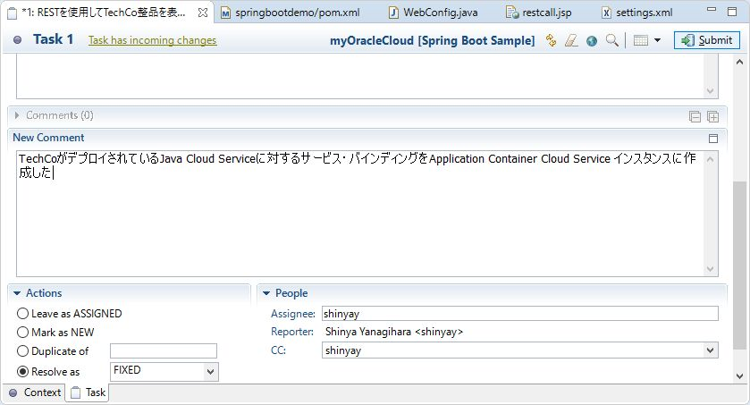


#### Developer Cloud Service UIを用いて変更の確認

Developer Cloud Service が開いているブラウザに変更する。ブラウザを閉じている場合は、Oracle Cloud へ[サインイン](../common/sign.in.to.oracle.cloud.md) し [(https://cloud.oracle.com/sign-in)](https://cloud.oracle.com/sign-in)、ダッシュボード画面の Developer Cloud Service のドロップダウンメニューから **サービス・コンソールを開く** を選択する。


ホーム画面では、直近の活動が確認できる。まず、プロジェクトに何が起こったか確認をする。画面を開いたままの場合、画面をリフレッシュすると最新のエントリーを確認できる。割り当てられたタスクに行った変更を確認する事ができる。画面をスクロール・ダウンして、`<プロジェクト名>.git` (*springboot.git*) の、マスター・ブランチに対してコードの変更をプッシュしたログのエントリーを見つける。

Git アイコン  がイベントのエントリーを見つけるのに役立つ。Git の変更を示す識別子を名前とするリンクをクリックする。

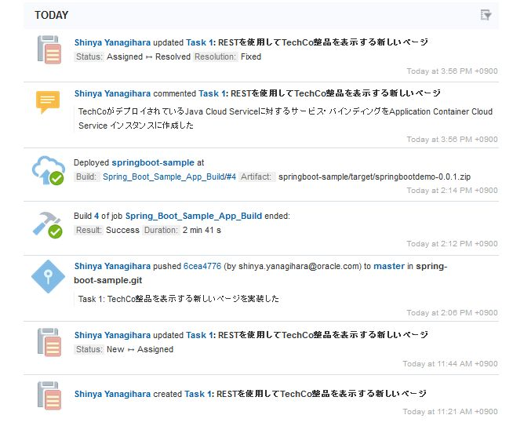

このリンクにより修正内容が含まれるGit の識別情報があるコード画面へリダイレクトする。スクロール・ダウンしすると、ソースコードで何が行われたか確認できる。


右上角に Git のコミット・コメントが確認できる。コメント入力時に ***Task 1*** と入力するとその場でリンクに変換されていた記述も確認できる。
Developer Cloud Service が適切な問題の識別情報として認識しているため表示できている。ここで **Task 1** リンクをクリックし、関連しているタスクに遷移する。必要があれば記述内容を修正できる。しかし、典型的な開発ワークフローでは QA チームが修正した問題をテストし、テストの結果に応じてステータスを **Verified** や **Reopened** に進める。

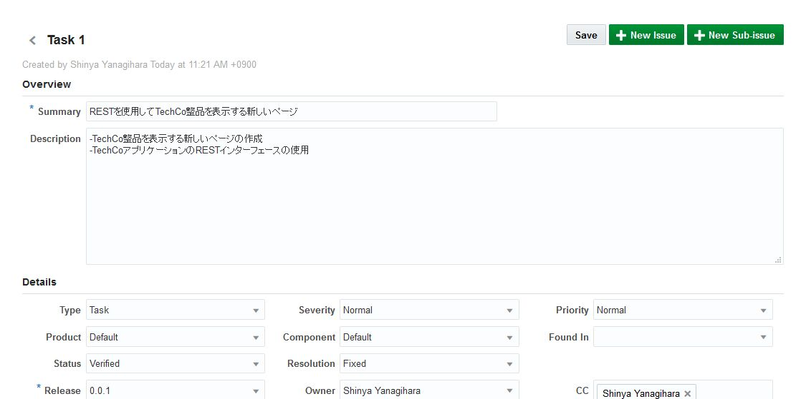


プロジェクトでは、タスクを作成したり、プロジェクト・メンバーに対して割り当てたりする前に、プロジェクトに関する製品や、コンポーネント、コンポーネント・オーナー、リリースや、タグといった属性値を定義する事が出来る。また、複数の整品カテゴリーや、コンポーネント、サブコンポーネントの定義や、リリースの単位や表記のカスタマイズ、カスタム・タグの使用、またプロジェクト固有のカスタム・フィールドの追加なども可能である。さらなる情報は、次の[documentation](http://docs.oracle.com/cloud/latest/devcs_common/CSDCS/GUID-FFB070E5-DA29-43EB-A0CA-3FA8BB3FC3E1.htm#CSDCS3146)で確認できる。
