---
# ORACLE Cloud-Native DevOps workshop #

## Developr Cloud Service を用いたApplication Container Cloud Service へのSpring Boot サンプル・アプリケーションのデプロイ

### About this tutorial ###
**Oracle Application Container Cloud Service** includes Oracle Java SE Cloud Service and Oracle Node Cloud Service. It provides a lightweight infrastructure so that you can run Java SE 7, Java SE 8, and Node.js applications in the Oracle Cloud.

**Oracle Developer Cloud Service** is a cloud-based software development Platform as a Service (PaaS) and a hosted environment for your application development infrastructure. It provides an open-source standards-based solution to manage the application development life cycle effectively through integration with Hudson, Git, Maven, issues, and wikis. Using Oracle Developer Cloud Service, you can commit your application source code to the Git repository on the Oracle Cloud, track assigned issues and defects online, share information using wiki pages, peer review the source code, and monitor project builds. After successful testing, you can deploy the project to Oracle Java Cloud Service - SaaS Extension, publicly available Oracle Java Cloud Service instances, Oracle Application Container Cloud Service instances, or to an on-premise production environment.


The key features of Oracle Developer Cloud Service include:

Project creation, configuration, and user management

+ Version control and source code management with Git
+ Storage of application dependencies and libraries with Maven
+ Continuous build integration with Hudson
+ Wiki for document collaboration
+ Issue tracking system to track tasks, defects, and features
+ Repository branch merge after code review
+ Deployment to Oracle Java Cloud Service - SaaS Extension, Oracle Java Cloud Service, and Oracle Application Container Cloud Service

Oracle Developer Cloud Service is available as a web interface accessible from a web browser and from Integrated Development Environments (IDEs) such as Oracle Enterprise Pack for Eclipse (OEPE), Oracle JDeveloper, and NetBeans IDE.

This tutorial shows how to deploy Spring Boot sample application to Application Container Cloud Services using Oracle Developer Cloud Services.

The Spring Boot sample application is a web application serving simple JSP pages.

This tutorial demonstrates how to:

- configure build job for sample application
- configure Application Container Cloud Service deployment in Developer Cloud Service
- build and deploy sample application using Developer Cloud Service

### 前提

- Developer Cloud Service が利用できるアカウントを保有している事

----

#### Developer Cloud Service プロジェクトへのサイン・イン

Oracle Cloud へサインインする[(https://cloud.oracle.com/sign-in)](https://cloud.oracle.com/sign-in)。
データセンターを選択し、アイデンティティドメインとアカウント情報を入力してログインする。
ログイン後、ダッシュボード画面の Developer Cloud Service のドロップダウンメニューから **サービス・コンソールを開く** を選択する。


Git リポジトリを指定し、Spring Boot サンプル・アプリケーションのソースコードを含むプロジェクトを選択する。

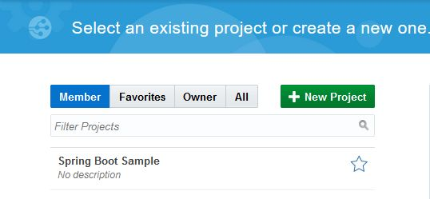


### Spring Boot サンプル・アプリケーション用のビルド・ジョブの構成

プロジェクトが作成されたら、Application Container Cloud Service 用のフォーマットのSpring Boot サンプル・アプリケーションのビルド・ジョブを作成する。


左部メニューから、**Build** を選択する。


表示されたビルド画面から、**New Job** をクリックする。


ジョブ名を入力し、***Create a free-style job*** を選択して**Save** をクリックする。

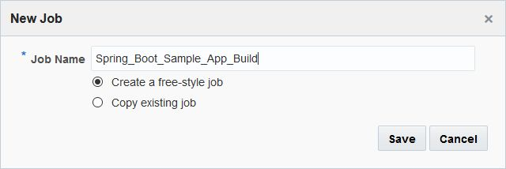


**Main** タブでJDKを **JDK 8** を選択する。


**Source Control** タブに移動し、**Git** を選択する。

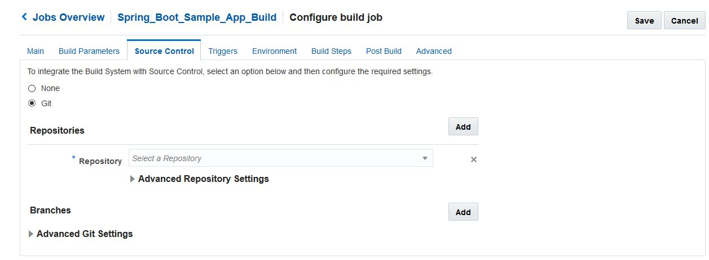


**Repository** にクローンした、**spring-boot-sample** リポジトリを選択する。Advanced Repository Settings はデフォルト値のままとする。


**Triggers** タブに移動し、**Based on SCM polling schedule** を選択する。この構成により、Git で管理するファイルに変更があるとビルド・ジョブが発動するようになる。

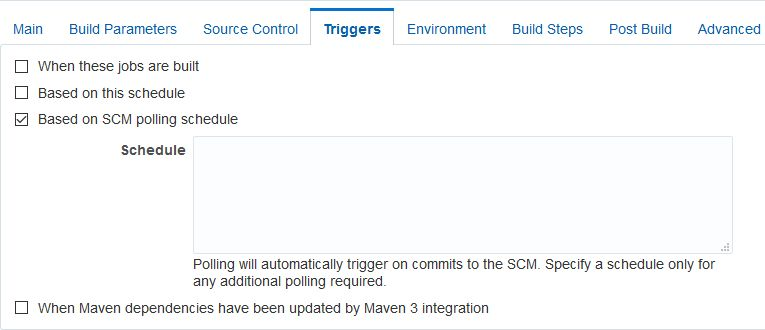


**Build Steps** タブに移動し、**Maven 3** を選択する。

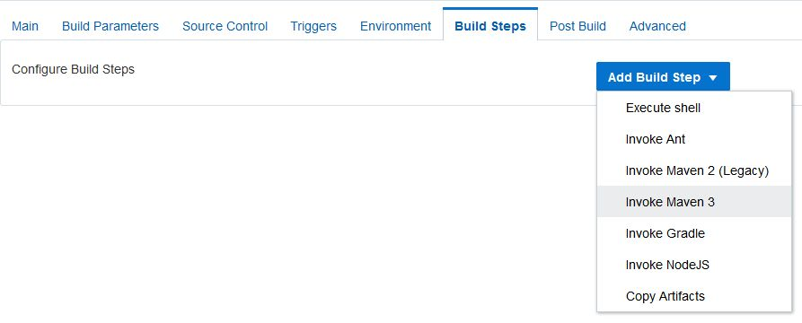


Goalsには **clean install** を設定し、POM Fileには**springboot-sample/pom.xml** を設定する。

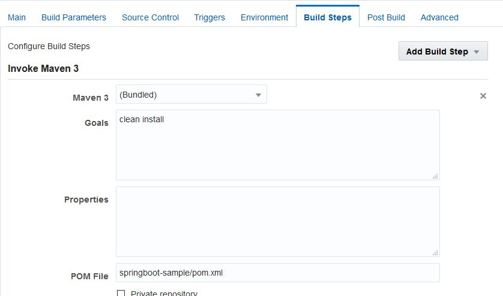


**Post Build** タブに移動し、**Archive the artifacts** を選択する。そして、**Files To Archive** に **springboot-sample/target/\*.zip** を入力する。最後に、**Save** をクリックする。


**Build Now** をクリックする。


ビルドが終了すると結果が表示され、アーカイブ・ファイルが作成される。

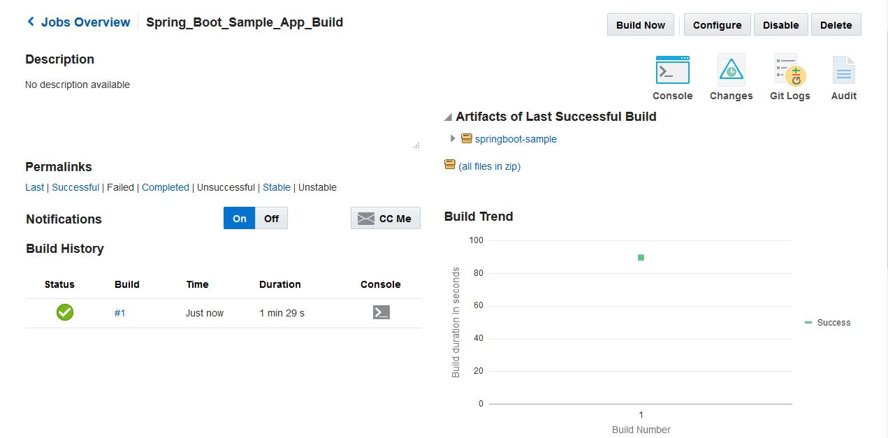


アーカイブ・ファイルを展開すると、`springbootdemo-0.0.1.zip` が表示される。

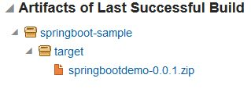


この`springbootdemo-0.0.1.zip` を展開すると `springbootdemo-0.0.1.war` と、 `manifest.json` が含まれている。


***manifest.json*** でエントリー・ポイントを指定しておくことが、Application Container Cloud Service 用のアプリケーション・フォーマットである。
```json
{
  "runtime": {
    "majorVersion": "8"
  },
  "command": "java -Dserver.port=$PORT -jar springbootdemo-0.0.1.war",
  "notes": "SpringBoot demo application"
}
```

### Application Container Cloud Service のデプロイメント構成 ###

次に、ビルド・ジョブが成功した場合にApplication Container Cloud Service に引き続きデプロイを実施する構成を行う。

左部メニューから、**Deploy** を選択する。


**New Configuration** をクリックする。

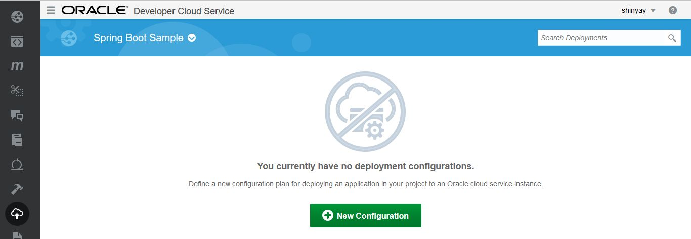


以下の項目を設定する。

- **Configuration Name**: デプロイメント構成を示す名称
- **Application Name**: Application Container Cloud Service のインスタンス名 (アプリケーションのアクセスURLに使用)
- **Deployment Target**: **New** をし、**Application Container Cloud Service** を選択する。


  - **Data center**: データセンタ名
  - **Identity Domain**: アイデンティティドメイン名
  - **Username**: Application Container CS ユーザ名
  - **Password**: Application Container CS パスワード


**Test Connection** をクリックし、接続設定の確認を行う。成功し、**Successful** と表示された後に **Use Connection** をクリックする。

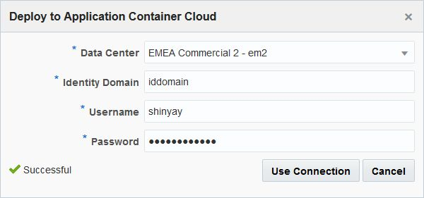

- **ACCS Properties/Runtime**: **Java**を選択
- **Type**: **Automatic** を選択
- **Job**: 先に作成したビルド・ジョブを選択
- **Artifact**: ビルドし作成されたアーカイブファイルを選択

**Save** をクリックする。


### サンプル・アプリケーションのビルド＆デプロイ ###

Application Container Cloud Service へデプロイするためにビルドを実行する方法は以下の方法がある。

1.**Deployments** からの起動
Deployments 画面のギアアイコンから**Start**を選択する。


2.**Build** からの起動
Build 画面に登録済みのビルド・ジョブを実行し、成功するとデプロイが実施される。Spring Boot サンプル・アプリケーション用のビルド・ジョブの右端にある **Build Now** をクリックする。


デプロイが終了すると、**Deploy** 画面に結果が表示される。左ペインの **Deploy to ACCS** をクリックすると、Application Container Cloud Service のダッシュボード画面に遷移する。


デプロイされたSpring Boot サンプル・アプリケーションが表示される。


URLをクリックすると、サンプル・アプリケーション画面が表示される。

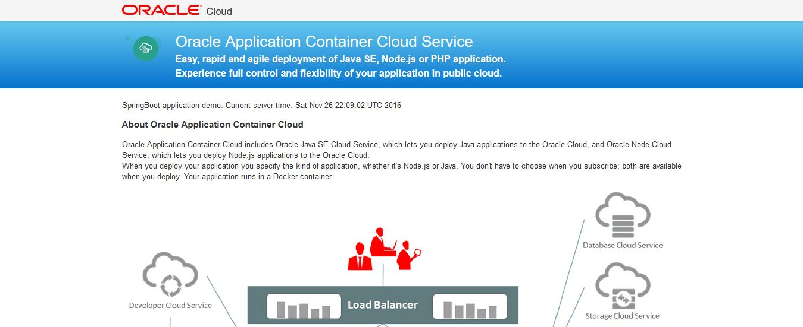
